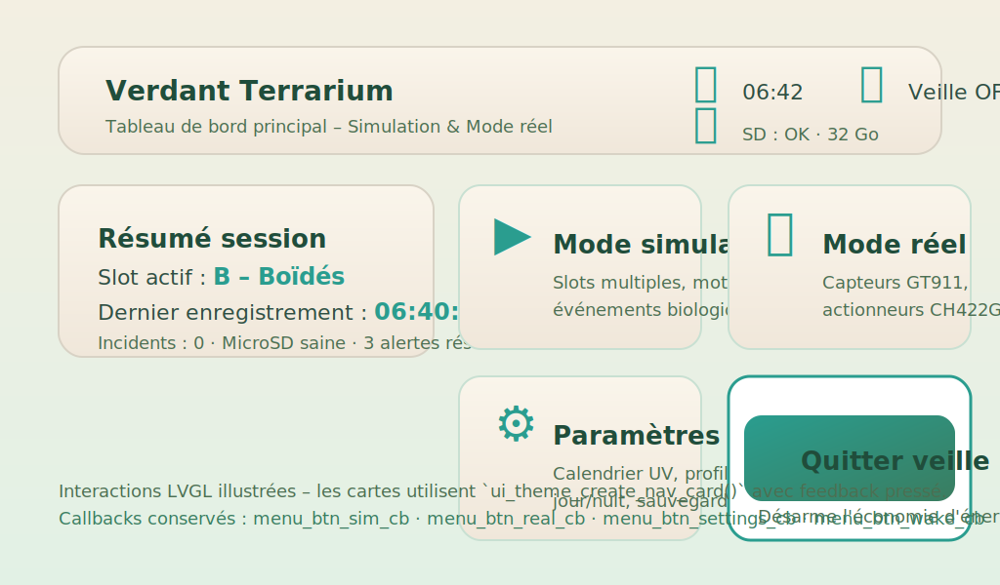
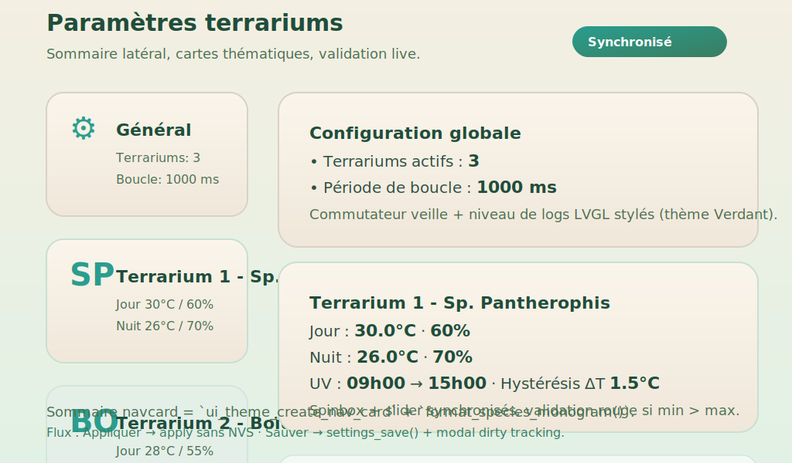
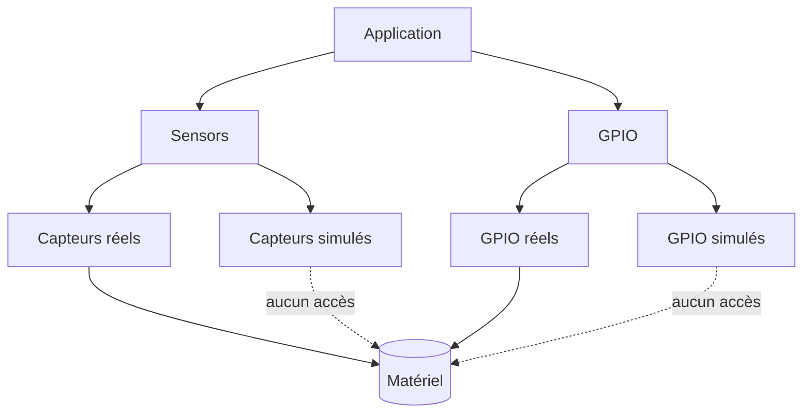

# Reptile Game on ESP32-S3 with 1024×600 LCD

| Supported Targets | ESP32-S3 |
|-------------------|----------|
| LCD Controller    | ST7262   |
| Touch Controller  | GT911    |

## Objectifs du projet
Ce dépôt illustre le développement d'un simulateur d'élevage multi-terrariums
exécuté sur un ESP32‑S3 associé à un écran TFT 1024×600. L'application combine
une logique métier riche (gestion de 25 terrariums en mode Réel, limitation à
`SIMULATION_TERRARIUM_LIMIT` = 2 en mode Simulation pour ménager les ressources,
conformité réglementaire, économie) et une interface LVGL avancée (tableaux,
graphiques, popups).
Le moteur graphique s'appuie sur LVGL et un pilote RGB ST7262, tandis qu'un
contrôleur tactile capacitif GT911 gère l'interaction utilisateur.

### Points clés

- Structures de données dédiées (`reptile_facility_t`, `terrarium_t`,
  `species_profile_t`, inventaire) pour piloter simultanément jusqu'à 25
  terrariums en mode Réel, avec plafonnement automatique à `SIMULATION_TERRARIUM_LIMIT`
  (2) en mode Simulation.
- Simulation complète des besoins biologiques (température, hygrométrie, UV,
  nutrition/hydratation), de la croissance, des pathologies et incidents
  réglementaires.
- Modèle économique détaillé (revenus, charges, amendes, inventaire) et API pour
  configurer substrat, chauffage, décor, UV et certificats.
- Référentiel réglementaire structuré (autorisations, certificats, registres,
  dimensions minimales) avec validation automatique des actions et écran LVGL
  pédagogique.
- Refonte totale de l'UI LVGL (vue pièce, fiche terrarium, synthèse économique,
  gestion des sauvegardes) et nouveaux assets LVGL.

Les profils d'espèces paramétriques utilisés par le moteur sont décrits dans
`assets/species_profiles.json`.

## Thème LVGL « Verdant Terrarium »

L'interface graphique s'appuie désormais sur un thème mutualisé accessible via
`main/ui_theme.c`. Le thème applique un fond dégradé (`0xF3EFE2 → 0xE2F1E5`)
évoquant la canopée, une palette primaire turquoise (`#2A9D8F`), des accents
forester (`#3A7D60`) et des teintes sable pour les arrière-plans de cartes.
Les typos utilisées sont `ui_font_montserrat_24_fr/20_fr/16_fr` (déclinaisons
latin-1 complètes) :

| Style | API | Usage | Caractéristiques |
|-------|-----|-------|------------------|
| Titre | `ui_theme_apply_title()` | entêtes d'écran, montants financiers | Montserrat 24, `#204D3B`. |
| Texte principal | `ui_theme_apply_body()` | libellés, données tabulaires | Montserrat 20, `#2F4F43`, interligne 4 px. |
| Légende | `ui_theme_apply_caption()` | statuts, info bulles | Montserrat 16, `#4C6F52`. |
| Cartes | `ui_theme_create_card()` | panneaux, en-têtes, widgets terrariums | Rayon 18 px, ombre douce, fond crème dégradé |
| Boutons primaires | `ui_theme_create_button(..., UI_THEME_BUTTON_PRIMARY, …)` | actions critiques (Sauvegarder, Nourrir…) | Dégradé turquoise, texte blanc, ombre 8 px |
| Boutons secondaires | `ui_theme_create_button(..., UI_THEME_BUTTON_SECONDARY, …)` | navigation, toggles | Fond clair, bord vert `#3A7D60`, texte `#2F4F43` |
| Tableaux | `ui_theme_apply_table()` | listes, tableaux réglementaires | En-tête vert pastel, cellules denses, surbrillance accent |
| Menus déroulants | `ui_theme_apply_dropdown()` | sélecteurs de slot, configuration terrarium | Rayon 12 px, bord `#8FBC8F` |

Les variantes embarquées couvrent tout le jeu de caractères Latin-1 (accents,
symboles monétaires `€`, unités `°`), supprimant les carrés de remplacement
observés sur la version précédente.

Les icônes terrarium (OK/alerte) et monnaie sont centralisées par
`ui_theme_get_icon(UI_THEME_ICON_*)`, garantissant une cohérence d'usage.
Toutes les scènes (`menu`, écrans Simulation/Économie/Réglementation, mode réel,
paramètres) appliquent le style de fond via `ui_theme_apply_screen()` et les
composants utilisent les helpers (`ui_theme_create_card`, `ui_theme_create_button`).

Un script d'accompagnement pour LVGL Theme Designer est fourni dans
`tools/ui_theme_designer.lua`. Il instancie les styles principaux (fond, cartes,
boutons, tableaux) et permet de tester l'esthétique dans l'outil officiel via
`dofile("ui_theme_designer.lua")(lvgl)`.

## Logique d'élevage

La logique métier est regroupée dans `components/reptile_logic/` :

| Structure | Rôle principal |
|-----------|----------------|
| `species_profile_t` | Paramètres biologiques et économiques d'une espèce (plages T°/HR/UV, rythme de croissance, coûts). |
| `terrarium_t` | État complet d'un terrarium (config matérielle, bio-statuts, certificats, incidents). |
| `reptile_facility_t` | Ensemble des 25 terrariums du mode Réel, inventaire, économie, cycle jour/nuit et métriques globales ; réduit dynamiquement à `SIMULATION_TERRARIUM_LIMIT` (2) en mode Simulation. |

Le moteur met à jour chaque seconde :

- les grandeurs physiologiques (satiété, hydratation, température, humidité,
  UV) en fonction du cycle jour/nuit et du profil d'espèce ;
- la consommation d'inventaire et les coûts associés (nourriture, eau,
  substrat, UV, décor) ;
- la progression de croissance, la masse corporelle, les stades de vie et les
  pathologies éventuelles ;
- la conformité documentaire (certificats CITES) et les amendes liées aux
  incidents.

### Référentiel réglementaire et obligations

Le module `components/regulations/` expose un référentiel statique des espèces
gérées (autorisée/interdite/soumise à autorisation), des exigences
documentaires (certificat de cession, registre Cerfa, programme pédagogique),
des dimensions minimales et des plages environnementales. L'API `regulations.h`
permet de valider un profil (`regulations_validate_species`), d'évaluer la
conformité d'un terrarium (`regulations_evaluate`) et d'obtenir les libellés
juridiques associés. Ces règles sont appliquées par `reptile_logic` lors de
chaque changement d'espèce, de configuration ou de document : les demandes non
conformes sont bloquées, des incidents sont levés (`REPTILE_INCIDENT_*`) et les
amendes calculées.

Un écran LVGL dédié (« Obligations ») liste le référentiel, les terrariums en
infraction et propose l'export d'un rapport CSV sur microSD
(`/sdcard/reports/…`). Les utilisateurs disposent ainsi d'un rappel pédagogique
des exigences légales françaises : arrêté du **8 octobre 2018** (conditions de
détention d'animaux non domestiques), **Règlement (CE) n° 338/97** relatif à la
mise en œuvre de CITES et articles **L413-2 / R413-23 du Code de
l'environnement** pour les obligations d'autorisation et d'information du
public.

L'état complet est persisté sur microSD via `reptile_facility_save` et
`reptile_facility_load` avec versionnement et slots multiples.

> **Note de migration :** lors du chargement d'une sauvegarde créée avant la
> réduction du mode Simulation, `reptile_facility_load` tronque automatiquement
> la liste des terrariums au plafond `SIMULATION_TERRARIUM_LIMIT` (2) tout en
> conservant les 25 terrariums disponibles en mode Réel.

## Prérequis
### Logiciel
- **ESP-IDF 5.5** installé et initialisé (`. ./export.sh`).
- **LVGL 9.x** via le gestionnaire de composants (`idf_component.yml`). Synchronisez la dépendance avec `idf.py add-dependency lvgl/lvgl^9` puis `idf.py reconfigure` ; l'abstraction entre les API LVGL 8/9 est centralisée dans `main/lvgl_compat.*`.

#### Initialisation de la dépendance LVGL 9.x
```sh
idf.py add-dependency lvgl/lvgl^9
idf.py reconfigure
```
Ces commandes assurent l'installation de LVGL 9.x dans `managed_components/` selon la version déclarée dans `idf_component.yml`.

### Matériel
- Carte de développement ESP32‑S3.
- Écran TFT 1024×600 piloté par **ST7262**.
- Contrôleur tactile capacitif **GT911**.

## Construction et flash
```sh
idf.py build flash monitor
```
Cette commande récupère automatiquement les dépendances déclarées dans `idf_component.yml`,
compile le projet, programme le microcontrôleur puis ouvre le moniteur série.

### Résolution de l'erreur « GetOverlappedResult failed (Access is denied) » sous Windows

Lorsque `idf.py monitor` échoue sur Windows avec l'erreur ci-dessus, appliquer la séquence
suivante élimine les conflits de port série :

1. Fermer *toutes* les applications susceptibles d'accéder au port COM (ESP Flash Download Tool,
   PuTTY, terminaux série VS Code, etc.).
2. Débrancher puis rebrancher le câble USB-C de la Waveshare ESP32-S3, patienter jusqu'à la
   réapparition du port dans le Gestionnaire de périphériques.
3. Lancer le moniteur avec la syntaxe complète du port : `idf.py -p \\.\\COMxx monitor`.
4. En cas de doute, exécuter l'invite PowerShell en administrateur et augmenter la vitesse avec
   `--monitor-baud 921600`.

Ces étapes garantissent la libération du port avant de relancer le moniteur ESP-IDF.

## Options de configuration
- `CONFIG_REPTILE_DEBUG` : désactive la mise en veille automatique au démarrage afin
  de faciliter le débogage. La veille peut ensuite être réactivée ou désactivée à
  l'exécution via le bouton **Veille ON/OFF** de l'interface.
- `CONFIG_I2C_MASTER_SDA_GPIO` / `CONFIG_I2C_MASTER_SCL_GPIO` : sélection des broches
  SDA/SCL partagées par le CH422G, le GT911 et les capteurs. Adapter ces valeurs si
  le faisceau a été recâblé.
- `CONFIG_I2C_MASTER_FREQUENCY_HZ` : fréquence du bus I²C (200 kHz par défaut) ; à
  réduire si les longueurs de nappe imposent une marge sur les fronts montants.
- `CONFIG_I2C_MASTER_ENABLE_INTERNAL_PULLUPS` : active les résistances internes de
  tirage pour consolider les pull-ups externes sur SDA/SCL.
- `CONFIG_CH422G_I2C_ADDRESS` / `CONFIG_CH422G_EXIO_SD_CS` : adresse 7 bits de
  l'extenseur et numéro d'EXIO pilotant la ligne CS du lecteur microSD. Le
  firmware scanne automatiquement la plage 0x20–0x23 puis l'adresse configurée
  afin de tenir compte des straps A0/A1 ou d'un module de rechange.
- `CONFIG_STORAGE_SD_USE_GPIO_CS` + `CONFIG_STORAGE_SD_GPIO_CS_NUM` : bypass du
  CH422G au profit d'un GPIO direct pour la CS microSD (câblage nécessaire).
- `CONFIG_STORAGE_SD_GPIO_FALLBACK` : bascule automatiquement la CS sur le GPIO
  de secours lorsque le CH422G reste muet au démarrage, afin que les tests SD
  et l'application continuent pendant le diagnostic matériel.
- `CONFIG_STORAGE_SD_GPIO_FALLBACK_AUTO_MOUNT` : lance automatiquement le montage
  de la carte lorsque le fallback est actif **uniquement** si EXIO4→GPIO34 est
  câblé. Laisser cette option désactivée lorsque la liaison n'est pas assurée
  pour éviter les blocages prolongés de `esp_vfs_fat_sdspi_mount()` et la
  réaction du watchdog.
- Lorsque le fallback est actif sans recâblage EXIO4→GPIO34, le firmware affiche
  désormais un avertissement persistant et n'effectue plus de redémarrage
  forcé. Suivre les instructions affichées dans le bandeau LVGL, câbler EXIO4→GPIO34
  puis activer `Automatically mount the fallback CS` pour récupérer les accès SD,
  ou laisser l'auto-mount désactivé tant que la réparation n'est pas terminée.
- Le pilote I²C déclenche automatiquement une récupération matérielle lorsque SDA/SCL
  restent bloquées (clock stretch infini, périphérique en erreur). Toutes les handles
  enregistrées (CH422G, multiplexeur, GT911…) sont relâchées puis recréées pour que
  le bus reparte proprement après réparation du câblage.

### Dépannage CH422G / microSD

Une procédure complète de diagnostic (mesures matérielles, réglages `menuconfig`,
recâblage du fallback et messages attendus dans `idf.py monitor`) est disponible
dans [`docs/troubleshooting/ch422g.md`](docs/troubleshooting/ch422g.md).

Pour isoler un défaut matériel, un firmware minimal d'analyse I²C est fourni
dans `tools/i2c_scanner`. Depuis ce dossier :

```bash
idf.py set-target esp32s3
idf.py -p COM9 build flash monitor
```

Le scanner journalise en continu l'état logique de SDA/SCL, indique les adresses
détectées sur le bus et surligne explicitement la présence du CH422G entre
0x20 et 0x23.

## Menu de démarrage et modes d'exécution
Au reset, le firmware présente un tableau de bord structuré : en-tête flex affichant le logo, l'heure
RTC, l'état de la microSD et de la veille automatique, grille de cartes de navigation (`ui_theme_create_nav_card`)
et bouton dédié « Quitter veille » pour désarmer l'économie d'énergie sans passer par les écrans
secondaires.



La capture vectorielle illustre la hiérarchie flex (en-tête, carte résumé, grille de cartes) telle qu'implémentée dans `main/main.c`, avec les icônes et sous-libellés injectés via `ui_theme_create_nav_card`.

- **Mode Simulation** : carte avec symbole ▶ et sous-libellé rappelant la simulation multislot,
  pointant vers `reptile_game_start`.
- **Mode Réel** : carte illustrée par l'icône terrarium, activant les pilotes physiques `sensors_real`
  et `gpio_real` puis `reptile_real_start`.
- **Paramètres** : carte aux engrenages LVGL pour configurer terrariums, calendriers et calibrations
  (`settings_screen_show`).
- **Quitter veille** : bouton secondaire qui appelle `sleep_set_enabled(false)` et met en pause le
  timer d'inactivité pour les sessions de démonstration.

La sélection reste persistée pour la session suivante afin de relancer automatiquement le mode
précédent. Le menu de simulation dispose en outre d'un widget « Résumé session » (slot actif,
microSD, derniers événements) qui remplace l'ancien label unique et fournit un retour d'état
immédiat lors des sauvegardes/chargements.

## Automatisation des terrariums réels
Le contrôleur d'environnement (`components/env_control/`) pilote désormais jusqu'à quatre
terrariums physiques en parallèle :

- profils jour/nuit indépendants avec plages cibles température/humidité et hystérésis
  asymétriques (marche/arrêt) ;
- planification de l'éclairage UV (heures d'allumage/extinction) avec possibilité de forcer
  manuellement un terrarium donné ;
- prise en compte de l'horloge système pour basculer automatiquement entre profils et pour
  horodater chaque acquisition ;
- suivi énergétique en Wh (chauffage, brumisation, UV) et gestion d'intervalles minimums entre
  deux cycles d'actionneurs afin de limiter l'usure.

Chaque minute, un historique circulaire est alimenté pour alimenter les graphiques LVGL et les
journaux CSV.

### Configuration persistante multi-terrariums
L'écran de paramètres (`settings_screen_show`) a été refondu autour d'une colonne de navigation
(`ui_theme_create_nav_card`) qui synthétise chaque terrarium (icône espèce, résumé jour/nuit) et
d'une zone de contenu à cartes thématiques. Les cartes regroupent les réglages généraux
(nombre de terrariums, période de boucle, veille, niveau de logs) et les profils détaillés
de chaque terrarium (consignes jour/nuit, hystérésis, UV, intervalles minimaux).



- Les spinbox et sliders sont couplés via `create_spin_slider_*`, avec légendes d'unités et
  validation instantanée (bordures rouges si `heat_on` ≤ `heat_off`, créneaux UV identiques…).
- Les horaires utilisent `create_time_control`, affichent un libellé HH:MM synchronisé et exposent
  des info-bulles pour contextualiser chaque champ.
- Le bandeau d'état applique `ui_theme_create_badge` pour signaler l'état de persistance
  (synchronisé, appliqué mais non sauvegardé, modifications en cours).
- Deux actions distinctes sont disponibles : **Appliquer** pousse immédiatement la configuration
  en RAM via `settings_apply()` sans écrire en flash, tandis que **Sauver** valide et persiste dans
  NVS (`settings_save()`). Un modal prévient l'utilisateur en cas de fermeture avec des changements
  non sauvegardés.

### Journalisation mode réel
Un enregistreur dédié (`logging_real_start`) consigne, pour chaque terrarium et à chaque mise à
jour, les mesures, consignes, états des actionneurs, drapeaux d'alarme et consommations
électriques dans `/sdcard/real/<index>_<nom>.csv`. Les fichiers sont distincts de ceux utilisés en
simulation et restent ouverts en écriture tant que le mode réel est actif. Ils peuvent être
analysés a posteriori (ex. import dans un tableur ou un notebook Python).

### Interface LVGL temps réel
`main/reptile_real.c` refond totalement l'écran réel : jauges température/hygrométrie, graphiques
glissants, boutons de forçage (chauffage, brumisation, UV), affichage des consommations et des
alarmes. Les mises à jour sont thread-safe via `lvgl_port_lock()` et chaque terrarium dispose de
son panneau dédié. Un bouton « Nourrir » global conserve la logique existante.

### Schéma de dépendances


### Chemins de sauvegarde et tests
Le module `reptile_facility` enregistre un fichier par mode et par slot sous le
point de montage `MOUNT_POINT` (par défaut `/sdcard`). Exemple :

- **Simulation** : `/sdcard/sim/slot_a.bin`, `/sdcard/sim/slot_b.bin`, …
- **Réel** : `/sdcard/real/slot_a.bin`, `/sdcard/real/slot_b.bin`, …

Pour valider la simulation sur un PC hôte, un binaire autonome peut être
compilé grâce aux stubs présents dans `tests/include/` :

```sh
gcc \
    tests/sim_reptile.c \
    components/reptile_logic/reptile_logic.c \
    components/regulations/regulations.c \
    components/config/game_mode.c \
    -Itests/include -Icomponents/reptile_logic -Icomponents/config \
    -Icomponents/regulations -lm -o sim_reptile && ./sim_reptile
```

Le programme imprime l'évolution de la croissance, des incidents de conformité
et de l'économie, vérifiant ainsi les nouvelles mécaniques.


## Structure des dossiers
```
.
├── components/     # Modules réutilisables (port LVGL, tactile, logique reptile, etc.)
├── main/           # Point d'entrée applicatif et logique du jeu
├── CMakeLists.txt
├── Makefile
└── ...
```

## Exemple d'exécution
Après flash, le moniteur série affiche :
```
I (0) boot: ESP-IDF v5.5
I (123) reptile_game: Initializing LVGL...
I (456) reptile_game: Game started, touch to feed the reptile!
```
L'écran LCD présente alors l'interface du jeu reptile avec interaction tactile.

Pour vérifier rapidement la structure des journaux temps réel exportés sur microSD, le script
`tests/validate_real_logs.py` peut être invoqué sur les fichiers CSV collectés :

```sh
python3 tests/validate_real_logs.py /chemin/vers/real/01_Terrarium.csv
```

## Trame CAN
Le firmware publie toutes les secondes l'état agrégé de l'élevage sur le bus
CAN à **125 kbps**.

- **Identifiant** : `0x101` (standard, 11 bits)
- **DLC** : 8 octets
- **Payload (little‑endian)** :

| Octets | Champ                            | Type            |
|-------:|----------------------------------|-----------------|
| 0      | Terrariums occupés               | `uint8`         |
| 1      | Alertes actives                  | `uint8`         |
| 2‑3    | Trésorerie / 1000 (€ signé)      | `int16`         |
| 4‑5    | Croissance moyenne (%) ×1        | `uint16`        |
| 6      | Terrariums en pathologie         | `uint8`         |
| 7      | Alertes de conformité            | `uint8`         |

Les valeurs sont mises à jour en parallèle de l'interface LVGL et permettent de
monitorer à distance la charge de travail, l'état sanitaire et la trésorerie.
