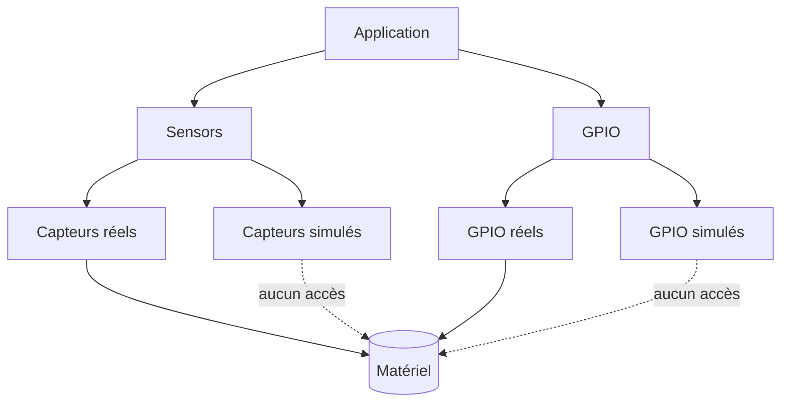

# Reptile Game on ESP32-S3 with 1024×600 LCD

| Supported Targets | ESP32-S3 |
|-------------------|----------|
| LCD Controller    | ST7262   |
| Touch Controller  | GT911    |

## Objectifs du projet
Ce dépôt illustre le développement d'un simulateur d'élevage multi-terrariums
exécuté sur un ESP32‑S3 associé à un écran TFT 1024×600. L'application combine
une logique métier riche (gestion de 25 terrariums, conformité réglementaire,
économie) et une interface LVGL avancée (tableaux, graphiques, popups).
Le moteur graphique s'appuie sur LVGL et un pilote RGB ST7262, tandis qu'un
contrôleur tactile capacitif GT911 gère l'interaction utilisateur.

### Points clés

- Structures de données dédiées (`reptile_facility_t`, `terrarium_t`,
  `species_profile_t`, inventaire) pour piloter simultanément jusqu'à 25
  terrariums.
- Simulation complète des besoins biologiques (température, hygrométrie, UV,
  nutrition/hydratation), de la croissance, des pathologies et incidents
  réglementaires.
- Modèle économique détaillé (revenus, charges, amendes, inventaire) et API pour
  configurer substrat, chauffage, décor, UV et certificats.
- Référentiel réglementaire structuré (autorisations, certificats, registres,
  dimensions minimales) avec validation automatique des actions et écran LVGL
  pédagogique.
- Refonte totale de l'UI LVGL (vue pièce, fiche terrarium, synthèse économique,
  gestion des sauvegardes) et nouveaux assets LVGL.

Les profils d'espèces paramétriques utilisés par le moteur sont décrits dans
`assets/species_profiles.json`.

## Logique d'élevage

La logique métier est regroupée dans `components/reptile_logic/` :

| Structure | Rôle principal |
|-----------|----------------|
| `species_profile_t` | Paramètres biologiques et économiques d'une espèce (plages T°/HR/UV, rythme de croissance, coûts). |
| `terrarium_t` | État complet d'un terrarium (config matérielle, bio-statuts, certificats, incidents). |
| `reptile_facility_t` | Ensemble des 25 terrariums, inventaire, économie, cycle jour/nuit et métriques globales. |

Le moteur met à jour chaque seconde :

- les grandeurs physiologiques (satiété, hydratation, température, humidité,
  UV) en fonction du cycle jour/nuit et du profil d'espèce ;
- la consommation d'inventaire et les coûts associés (nourriture, eau,
  substrat, UV, décor) ;
- la progression de croissance, la masse corporelle, les stades de vie et les
  pathologies éventuelles ;
- la conformité documentaire (certificats CITES) et les amendes liées aux
  incidents.

### Référentiel réglementaire et obligations

Le module `components/regulations/` expose un référentiel statique des espèces
gérées (autorisée/interdite/soumise à autorisation), des exigences
documentaires (certificat de cession, registre Cerfa, programme pédagogique),
des dimensions minimales et des plages environnementales. L'API `regulations.h`
permet de valider un profil (`regulations_validate_species`), d'évaluer la
conformité d'un terrarium (`regulations_evaluate`) et d'obtenir les libellés
juridiques associés. Ces règles sont appliquées par `reptile_logic` lors de
chaque changement d'espèce, de configuration ou de document : les demandes non
conformes sont bloquées, des incidents sont levés (`REPTILE_INCIDENT_*`) et les
amendes calculées.

Un écran LVGL dédié (« Obligations ») liste le référentiel, les terrariums en
infraction et propose l'export d'un rapport CSV sur microSD
(`/sdcard/reports/…`). Les utilisateurs disposent ainsi d'un rappel pédagogique
des exigences légales françaises : arrêté du **8 octobre 2018** (conditions de
détention d'animaux non domestiques), **Règlement (CE) n° 338/97** relatif à la
mise en œuvre de CITES et articles **L413-2 / R413-23 du Code de
l'environnement** pour les obligations d'autorisation et d'information du
public.

L'état complet est persisté sur microSD via `reptile_facility_save` et
`reptile_facility_load` avec versionnement et slots multiples.

## Prérequis
### Logiciel
- **ESP-IDF 5.5** installé et initialisé (`. ./export.sh`).
- **LVGL 8.3.9** via le gestionnaire de composants (`idf_component.yml`).

### Matériel
- Carte de développement ESP32‑S3.
- Écran TFT 1024×600 piloté par **ST7262**.
- Contrôleur tactile capacitif **GT911**.

## Construction et flash
```sh
idf.py build flash monitor
```
Cette commande récupère automatiquement les dépendances déclarées dans `idf_component.yml`,
compile le projet, programme le microcontrôleur puis ouvre le moniteur série.

### Résolution de l'erreur « GetOverlappedResult failed (Access is denied) » sous Windows

Lorsque `idf.py monitor` échoue sur Windows avec l'erreur ci-dessus, appliquer la séquence
suivante élimine les conflits de port série :

1. Fermer *toutes* les applications susceptibles d'accéder au port COM (ESP Flash Download Tool,
   PuTTY, terminaux série VS Code, etc.).
2. Débrancher puis rebrancher le câble USB-C de la Waveshare ESP32-S3, patienter jusqu'à la
   réapparition du port dans le Gestionnaire de périphériques.
3. Lancer le moniteur avec la syntaxe complète du port : `idf.py -p \\.\\COMxx monitor`.
4. En cas de doute, exécuter l'invite PowerShell en administrateur et augmenter la vitesse avec
   `--monitor-baud 921600`.

Ces étapes garantissent la libération du port avant de relancer le moniteur ESP-IDF.

## Options de configuration
- `CONFIG_REPTILE_DEBUG` : désactive la mise en veille automatique au démarrage afin
  de faciliter le débogage. La veille peut ensuite être réactivée ou désactivée à
  l'exécution via le bouton **Veille ON/OFF** de l'interface.
- `CONFIG_I2C_MASTER_SDA_GPIO` / `CONFIG_I2C_MASTER_SCL_GPIO` : sélection des broches
  SDA/SCL partagées par le CH422G, le GT911 et les capteurs. Adapter ces valeurs si
  le faisceau a été recâblé.
- `CONFIG_I2C_MASTER_FREQUENCY_HZ` : fréquence du bus I²C (200 kHz par défaut) ; à
  réduire si les longueurs de nappe imposent une marge sur les fronts montants.
- `CONFIG_I2C_MASTER_ENABLE_INTERNAL_PULLUPS` : active les résistances internes de
  tirage pour consolider les pull-ups externes sur SDA/SCL.
- `CONFIG_CH422G_I2C_ADDRESS` / `CONFIG_CH422G_EXIO_SD_CS` : adresse 7 bits de
  l'extenseur et numéro d'EXIO pilotant la ligne CS du lecteur microSD.
- `CONFIG_CH422G_AUTOSCAN_ADDRESSES` : active la recherche automatique des
  adresses 0x20–0x27 si l'expandeur ne répond pas sur l'adresse configurée.
- `CONFIG_STORAGE_SD_USE_GPIO_CS` + `CONFIG_STORAGE_SD_GPIO_CS_NUM` : bypass du
  CH422G au profit d'un GPIO direct pour la CS microSD (câblage nécessaire).

### Fallback CS microSD

Par défaut, le projet active un fil de secours reliant la broche **GPIO34** de
l'ESP32‑S3 directement à l'entrée **CS** du lecteur microSD. Cette modification
matérielle contourne totalement le CH422G en cas de défaillance du bus I²C.

1. Câbler GPIO34 (disponible sur le connecteur d'extension Waveshare) vers la
   ligne **CS** du convertisseur de niveau du lecteur microSD.
2. Conserver le retour de masse commun et l'alimentation 3V3.
3. Laisser INT0/INT1 du CH422G en l'air : l'expandeur peut continuer à piloter
   les autres lignes même si la CS est isolée.

Au démarrage, le firmware signale dans les logs la mise en service du fallback :

```
I (XXX) sd: Direct SD CS fallback active on GPIO34
```

Si le CH422G redevient fonctionnel, il suffit de repasser `CONFIG_STORAGE_SD_USE_GPIO_CS` à `n` pour revenir au câblage d'origine.

## Menu de démarrage et modes d'exécution
Au reset, le firmware affiche un menu minimaliste permettant de choisir entre deux modes :

- **Simulation** : emploi des pilotes `sensors_sim` et `gpio_sim`. Ces implémentations génèrent
  des valeurs factices ou celles injectées par l'API de simulation et *n'accèdent jamais au
  matériel*.
- **Réel** : activation des pilotes `sensors_real` et `gpio_real` qui dialoguent directement avec
  les capteurs I²C et les broches GPIO.

La sélection est persistée pour la session suivante afin de relancer automatiquement le mode
précédent.

## Automatisation des terrariums réels
Le contrôleur d'environnement (`components/env_control/`) pilote désormais jusqu'à quatre
terrariums physiques en parallèle :

- profils jour/nuit indépendants avec plages cibles température/humidité et hystérésis
  asymétriques (marche/arrêt) ;
- planification de l'éclairage UV (heures d'allumage/extinction) avec possibilité de forcer
  manuellement un terrarium donné ;
- prise en compte de l'horloge système pour basculer automatiquement entre profils et pour
  horodater chaque acquisition ;
- suivi énergétique en Wh (chauffage, brumisation, UV) et gestion d'intervalles minimums entre
  deux cycles d'actionneurs afin de limiter l'usure.

Chaque minute, un historique circulaire est alimenté pour alimenter les graphiques LVGL et les
journaux CSV.

### Configuration persistante multi-terrariums
L'écran de paramètres (`settings_screen_show`) expose une interface tabulaire permettant de
configurer chaque terrarium (nom, seuils jour/nuit, hystérésis, horaires, UV, intervalles min.).
Les réglages sont sérialisés via NVS (`KEY_ENV`) et réappliqués au démarrage en même temps que
les préférences de veille et de niveau de logs. L'appel à `settings_apply()` propage immédiatement
la configuration vers le contrôleur d'environnement même si le mode réel est déjà actif.

### Journalisation mode réel
Un enregistreur dédié (`logging_real_start`) consigne, pour chaque terrarium et à chaque mise à
jour, les mesures, consignes, états des actionneurs, drapeaux d'alarme et consommations
électriques dans `/sdcard/real/<index>_<nom>.csv`. Les fichiers sont distincts de ceux utilisés en
simulation et restent ouverts en écriture tant que le mode réel est actif. Ils peuvent être
analysés a posteriori (ex. import dans un tableur ou un notebook Python).

### Interface LVGL temps réel
`main/reptile_real.c` refond totalement l'écran réel : jauges température/hygrométrie, graphiques
glissants, boutons de forçage (chauffage, brumisation, UV), affichage des consommations et des
alarmes. Les mises à jour sont thread-safe via `lvgl_port_lock()` et chaque terrarium dispose de
son panneau dédié. Un bouton « Nourrir » global conserve la logique existante.

### Schéma de dépendances


### Chemins de sauvegarde et tests
Le module `reptile_facility` enregistre un fichier par mode et par slot sous le
point de montage `MOUNT_POINT` (par défaut `/sdcard`). Exemple :

- **Simulation** : `/sdcard/sim/slot_a.bin`, `/sdcard/sim/slot_b.bin`, …
- **Réel** : `/sdcard/real/slot_a.bin`, `/sdcard/real/slot_b.bin`, …

Pour valider la simulation sur un PC hôte, un binaire autonome peut être
compilé grâce aux stubs présents dans `tests/include/` :

```sh
gcc \
    tests/sim_reptile.c \
    components/reptile_logic/reptile_logic.c \
    components/regulations/regulations.c \
    components/config/game_mode.c \
    -Itests/include -Icomponents/reptile_logic -Icomponents/config \
    -Icomponents/regulations -lm -o sim_reptile && ./sim_reptile
```

Le programme imprime l'évolution de la croissance, des incidents de conformité
et de l'économie, vérifiant ainsi les nouvelles mécaniques.


## Structure des dossiers
```
.
├── components/     # Modules réutilisables (port LVGL, tactile, logique reptile, etc.)
├── main/           # Point d'entrée applicatif et logique du jeu
├── CMakeLists.txt
├── Makefile
└── ...
```

## Exemple d'exécution
Après flash, le moniteur série affiche :
```
I (0) boot: ESP-IDF v5.5
I (123) reptile_game: Initializing LVGL...
I (456) reptile_game: Game started, touch to feed the reptile!
```
L'écran LCD présente alors l'interface du jeu reptile avec interaction tactile.

Pour vérifier rapidement la structure des journaux temps réel exportés sur microSD, le script
`tests/validate_real_logs.py` peut être invoqué sur les fichiers CSV collectés :

```sh
python3 tests/validate_real_logs.py /chemin/vers/real/01_Terrarium.csv
```

## Trame CAN
Le firmware publie toutes les secondes l'état agrégé de l'élevage sur le bus
CAN à **125 kbps**.

- **Identifiant** : `0x101` (standard, 11 bits)
- **DLC** : 8 octets
- **Payload (little‑endian)** :

| Octets | Champ                            | Type            |
|-------:|----------------------------------|-----------------|
| 0      | Terrariums occupés               | `uint8`         |
| 1      | Alertes actives                  | `uint8`         |
| 2‑3    | Trésorerie / 1000 (€ signé)      | `int16`         |
| 4‑5    | Croissance moyenne (%) ×1        | `uint16`        |
| 6      | Terrariums en pathologie         | `uint8`         |
| 7      | Alertes de conformité            | `uint8`         |

Les valeurs sont mises à jour en parallèle de l'interface LVGL et permettent de
monitorer à distance la charge de travail, l'état sanitaire et la trésorerie.
