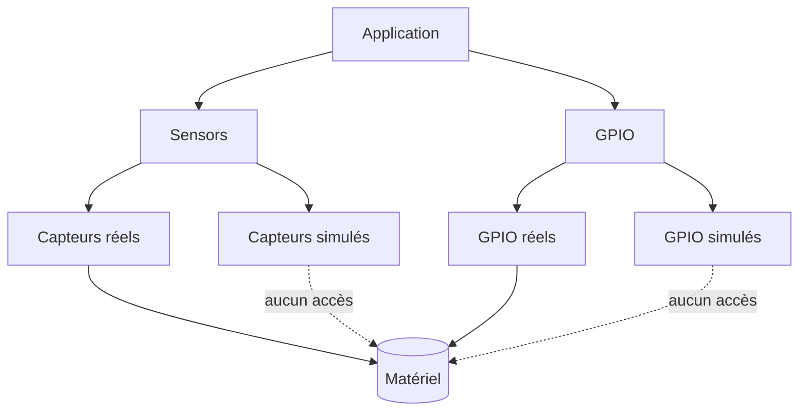

# Reptile Game on ESP32-S3 with 1024×600 LCD

| Supported Targets | ESP32-S3 |
|-------------------|----------|
| LCD Controller    | ST7262   |
| Touch Controller  | GT911    |

## Objectifs du projet
Ce dépôt illustre le développement d'un simulateur d'élevage multi-terrariums
exécuté sur un ESP32‑S3 associé à un écran TFT 1024×600. L'application combine
une logique métier riche (gestion de 25 terrariums, conformité réglementaire,
économie) et une interface LVGL avancée (tableaux, graphiques, popups).
Le moteur graphique s'appuie sur LVGL et un pilote RGB ST7262, tandis qu'un
contrôleur tactile capacitif GT911 gère l'interaction utilisateur.

### Points clés

- Structures de données dédiées (`reptile_facility_t`, `terrarium_t`,
  `species_profile_t`, inventaire) pour piloter simultanément jusqu'à 25
  terrariums.
- Simulation complète des besoins biologiques (température, hygrométrie, UV,
  nutrition/hydratation), de la croissance, des pathologies et incidents
  réglementaires.
- Modèle économique détaillé (revenus, charges, amendes, inventaire) et API pour
  configurer substrat, chauffage, décor, UV et certificats.
- Refonte totale de l'UI LVGL (vue pièce, fiche terrarium, synthèse économique,
  gestion des sauvegardes) et nouveaux assets LVGL.

Les profils d'espèces paramétriques utilisés par le moteur sont décrits dans
`assets/species_profiles.json`.

## Logique d'élevage

La logique métier est regroupée dans `components/reptile_logic/` :

| Structure | Rôle principal |
|-----------|----------------|
| `species_profile_t` | Paramètres biologiques et économiques d'une espèce (plages T°/HR/UV, rythme de croissance, coûts). |
| `terrarium_t` | État complet d'un terrarium (config matérielle, bio-statuts, certificats, incidents). |
| `reptile_facility_t` | Ensemble des 25 terrariums, inventaire, économie, cycle jour/nuit et métriques globales. |

Le moteur met à jour chaque seconde :

- les grandeurs physiologiques (satiété, hydratation, température, humidité,
  UV) en fonction du cycle jour/nuit et du profil d'espèce ;
- la consommation d'inventaire et les coûts associés (nourriture, eau,
  substrat, UV, décor) ;
- la progression de croissance, la masse corporelle, les stades de vie et les
  pathologies éventuelles ;
- la conformité documentaire (certificats CITES) et les amendes liées aux
  incidents.

L'état complet est persisté sur microSD via `reptile_facility_save` et
`reptile_facility_load` avec versionnement et slots multiples.

## Prérequis
### Logiciel
- **ESP-IDF 5.5** installé et initialisé (`. ./export.sh`).
- **LVGL 8.3.9** via le gestionnaire de composants (`idf_component.yml`).

### Matériel
- Carte de développement ESP32‑S3.
- Écran TFT 1024×600 piloté par **ST7262**.
- Contrôleur tactile capacitif **GT911**.

## Construction et flash
```sh
idf.py build flash monitor
```
Cette commande récupère automatiquement les dépendances déclarées dans `idf_component.yml`,
compile le projet, programme le microcontrôleur puis ouvre le moniteur série.

## Options de configuration
- `CONFIG_REPTILE_DEBUG` : désactive la mise en veille automatique au démarrage afin
  de faciliter le débogage. La veille peut ensuite être réactivée ou désactivée à
  l'exécution via le bouton **Veille ON/OFF** de l'interface.

## Menu de démarrage et modes d'exécution
Au reset, le firmware affiche un menu minimaliste permettant de choisir entre deux modes :

- **Simulation** : emploi des pilotes `sensors_sim` et `gpio_sim`. Ces implémentations génèrent
  des valeurs factices ou celles injectées par l'API de simulation et *n'accèdent jamais au
  matériel*.
- **Réel** : activation des pilotes `sensors_real` et `gpio_real` qui dialoguent directement avec
  les capteurs I²C et les broches GPIO.

La sélection est persistée pour la session suivante afin de relancer automatiquement le mode
précédent.

### Schéma de dépendances


### Chemins de sauvegarde et tests
Le module `reptile_facility` enregistre un fichier par mode et par slot sous le
point de montage `MOUNT_POINT` (par défaut `/sdcard`). Exemple :

- **Simulation** : `/sdcard/sim/slot_a.bin`, `/sdcard/sim/slot_b.bin`, …
- **Réel** : `/sdcard/real/slot_a.bin`, `/sdcard/real/slot_b.bin`, …

Pour valider la simulation sur un PC hôte, un binaire autonome peut être
compilé grâce aux stubs présents dans `tests/include/` :

```sh
gcc -DGAME_MODE_SIMULATION \
    tests/sim_reptile.c \
    components/reptile_logic/reptile_logic.c \
    -Itests/include -Icomponents/reptile_logic -Icomponents/config \
    -lm -o sim_reptile && ./sim_reptile
```

Le programme imprime l'évolution de la croissance, des incidents de conformité
et de l'économie, vérifiant ainsi les nouvelles mécaniques.


## Structure des dossiers
```
.
├── components/     # Modules réutilisables (port LVGL, tactile, logique reptile, etc.)
├── main/           # Point d'entrée applicatif et logique du jeu
├── CMakeLists.txt
├── Makefile
└── ...
```

## Exemple d'exécution
Après flash, le moniteur série affiche :
```
I (0) boot: ESP-IDF v5.5
I (123) reptile_game: Initializing LVGL...
I (456) reptile_game: Game started, touch to feed the reptile!
```
L'écran LCD présente alors l'interface du jeu reptile avec interaction tactile.

## Trame CAN
Le firmware publie toutes les secondes l'état agrégé de l'élevage sur le bus
CAN à **125 kbps**.

- **Identifiant** : `0x101` (standard, 11 bits)
- **DLC** : 8 octets
- **Payload (little‑endian)** :

| Octets | Champ                            | Type            |
|-------:|----------------------------------|-----------------|
| 0      | Terrariums occupés               | `uint8`         |
| 1      | Alertes actives                  | `uint8`         |
| 2‑3    | Trésorerie / 1000 (€ signé)      | `int16`         |
| 4‑5    | Croissance moyenne (%) ×1        | `uint16`        |
| 6      | Terrariums en pathologie         | `uint8`         |
| 7      | Alertes de conformité            | `uint8`         |

Les valeurs sont mises à jour en parallèle de l'interface LVGL et permettent de
monitorer à distance la charge de travail, l'état sanitaire et la trésorerie.
